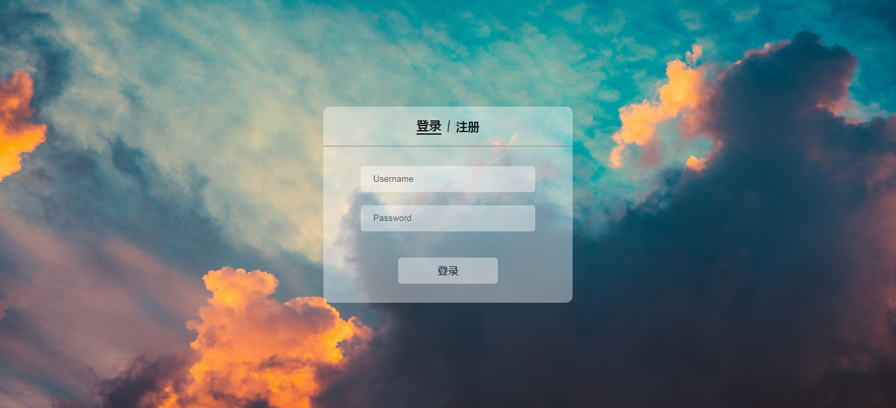
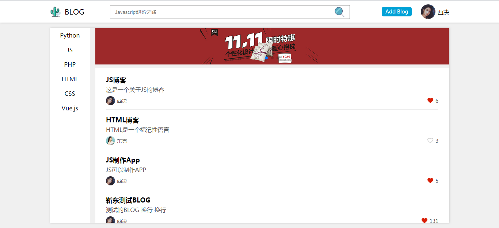
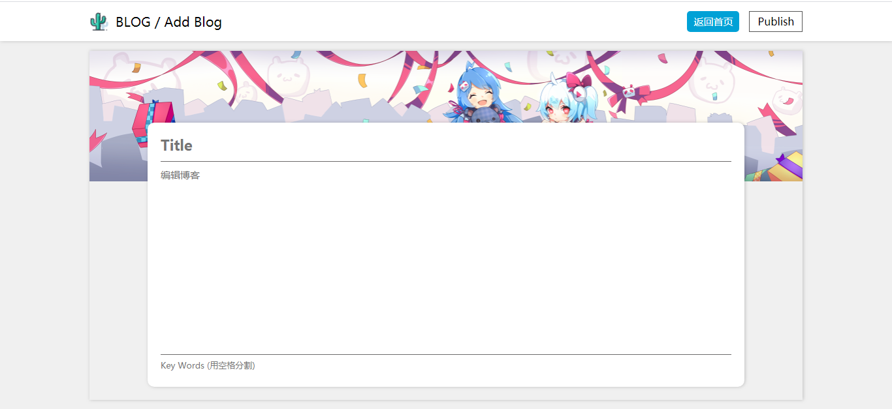
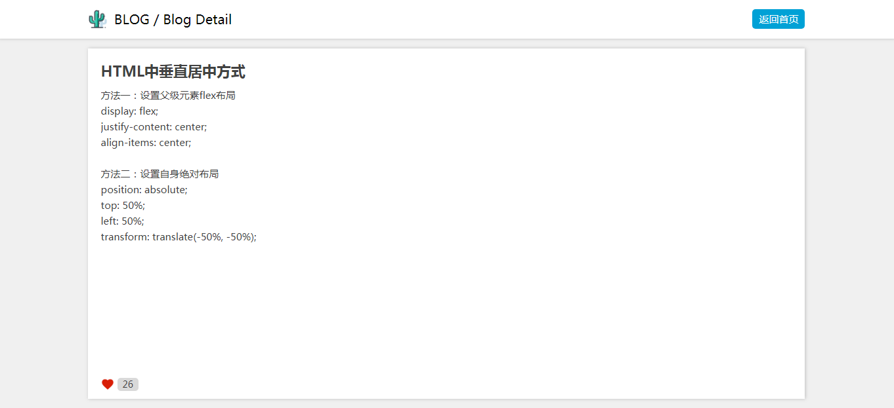
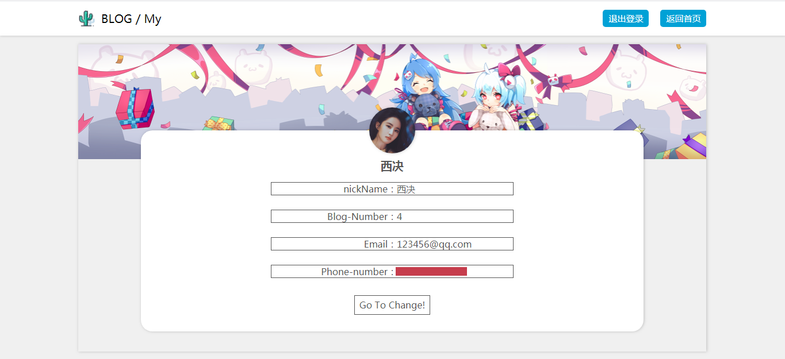
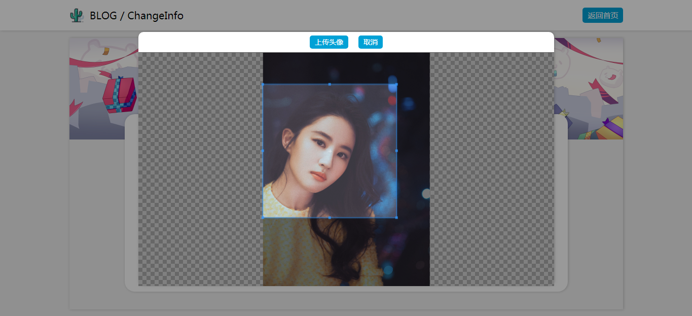
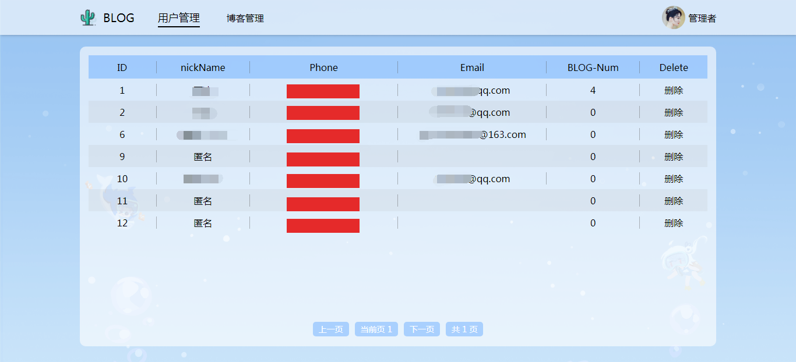
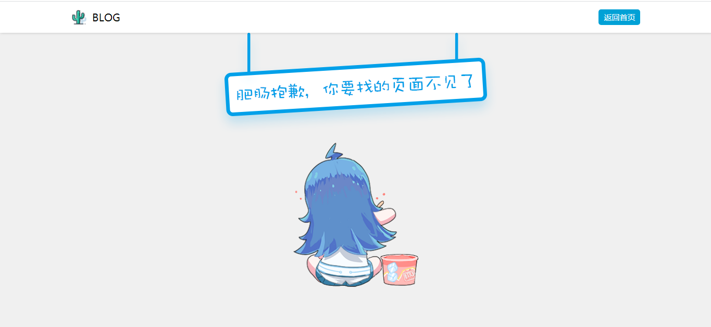

# BLOG 项目
## 1. 项目介绍：
&emsp;&emsp;该项目为个人博客项目，包括用户端和后台，采用的是前后端分离的方式，前端使用Vue框架，后端使用Node.js，使用Express框架，数据库采用MySQL数据库。

&emsp;&emsp;用户端方面，每一位用户都需要进行注册和登录，每一位用户都有一个个人主页，展示个人的信息，同时用户也可以修改自己的相关信息。同时每一位用户都可以发布博客，可以查看自己发布的博客，以及自己收藏的博客。

&emsp;&emsp;每一篇博客，都有一个文章id，每一个博客都能被收藏。用户在发布博客的时候，需要让用户选择或添加博客的分类，这样其他用户可以根据相关的博客分类查询到博客。

&emsp;&emsp;后台方面，要拥有管理员账户才能够登录，管理员拥有最高的权限，管理员可以删除任意一个博客或用户。

## 2. 相关框架和数据库
- Vue
- jQuery
- axios
- Node
- Express
- MySQL

## 3. 页面展示

    
    
    
    
    
    
    
    
    

## 4. MySQL数据库表设计
### 4.1 use表
|id|nike_name|password|avatar|blog_num|collection|phone|email|

|:---:|:---:|:---:|:---:|:---:|:---:|:---:|:---:|:---:|

|用户id|昵称|登录密码|头像|博客数量|用户收藏的博客|手机号|邮箱|
> 注意：
> - nick_name的默认值为'匿名'
> - avatar的默认值为'../public/img/defaultAvatar.jpg'
> - blog_num的默认值为0，

### 4.2 blog_content表
|id|content|img|user_id|collection_num|title|keywords|

|:---:|:---:|:---:|:---:|:---:|:---:|:---:|:---:|

|博客id|博客内容|博客的图片|博客作者id|博客被收藏数量|标题|关键词|
> 注意：collection_num的默认值为0

### 4.3 admin表
|id|user_name|password|
|:---:|:---:|:---:|
|管理员id|管理员账号|密码|

## 5. 接口
接口详情可以查看当前目录下的 ***接口文档.md***  文件
